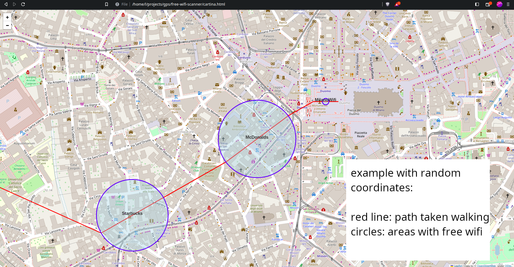

# free-wifi-scanner
A python3 software that scans for unprotected wifi networks and creates a map which displays the areas covered by the access points

### Disclaimer
**This software has been created with the sole purpose of scanning around for free networks. It DOES NOT try to connect any device to said networks. Depending on the country in which you're in, there might be legal consequences if you try to connect to a network without the owner consent, or maybe even to scan around for said networks. Please do your own research. If you decide to perform any of these actions on any network that you don't own, do it at your own risk.**

# How to use
## 1. Setting up
Clone the repo
```
git clone https://github.com/leapbtw/free-wifi-scanner.git
cd free-wifi-scanner
```
Get an API key from Google https://console.cloud.google.com/marketplace/product/google/geolocation.googleapis.com (you can use free trial), and save it in plain text to .api.txt

## 2. Install the requirements
```
pip install -r requirements.txt
```

## 3. Run the software
the device running the software is supposed to be moving: the software will create a map that displays the path taken when moving around, and any free networks discovered while running
```
python3 scanner.py
```
if the software doesn't recognize any wireless interface, specify it with
```
python3 scanner.py -i <name of the interface>
```
the software will generate a CSV file which contains any data harvested while running


## 4. Create the map
```
python3 create_map.py example.csv
```
this will create a **map.html** file in the current directory. Open it in your browser


